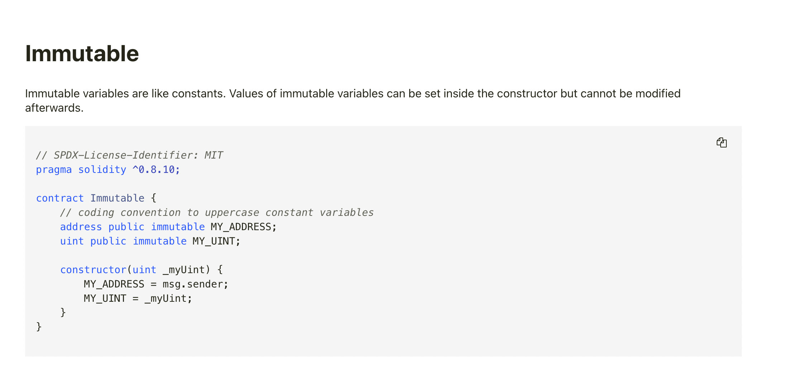

Solidity is by far the most popular language to write smart contracts at the moment as the EVM is the most widely adopted virtual machine out there. Not only is it used in Ethereum's execution layer, but many alt L1s and L2s on Ethereum use the EVM as their virtual machine since there's a fairly mature development ecosystem. In order to first learn Solidity, we'll go over a few simple courses that explain the principles of the language, and as we progress further we will talk about design patterns, testing, security, oracles, and more.

One of the best ways to learn basic Solidity is the [playlist](https://www.youtube.com/playlist?list=PLO5VPQH6OWdVQwpQfw9rZ67O6Pjfo6q-p) from [Smart Contract Programmer](https://twitter.com/ProgrammerSmart) on YouTube. This one is a bit better as it covers Solidity 0.8.0 which is a fairly recent version. Also go through the [Solidity-by-example](https://solidity-by-example.org/) smart contracts which teach you the basics of Solidity, some common security vulnerabilities and the implementations of some popular patterns.

[CryptoZombies](https://cryptozombies.io/en/course/) is an interactive web application that teaches you the basics of Solidity through a fun development game. It teaches you how to create a contract, the data types that Solidity supports, how to write methods, how to manage objects, events, inheritance, memory management, interfaces, modifiers, and more. By the time you finish the first three short courses, you'll be able to read and write Solidity code.

After we finish the course with the basics, we'll move on to building small projects implementing various different protocols, applications, and cryptographic primitives through the use of the [scaffold-eth](https://github.com/scaffold-eth/scaffold-eth) challenge that appear in [this thread](https://twitter.com/austingriffith/status/1483834810359377923?s=20&t=lkXzcAH2cT5xf7btyMAs0A). Scaffold-eth is a web3 development template built by [Austin Griffith](https://twitter.com/austingriffith) and open-source contributors which abstracts the backend of your app and creates a front-end interface for interacting with the smart contracts that you write. We will start with the [Ethereum Speed Run](https://speedrunethereum.com/
) challenges in the thread mentioned above, and continue with building more complex applications like a [signature-based multisig](https://github.com/scaffold-eth/scaffold-eth-examples/tree/meta-multi-sig), an [app that uploads images to IPFS](https://github.com/scaffold-eth/scaffold-eth/tree/image-upload-ipfs), and more.

Now that you've been writing more and more complex smart contracts it is a good idea to start looking at other people's code to get a feel for how they implement different features, how they structure code, what designs and patterns they use, how they optimize for gas, and a lot more.

There are many techniques that you'll be picking up along on your journey in order to make your contracts more resource-effective and gas-optimized so that your users don't need to spend as much money for using your applications.

A good example of well-made smart contracts at the intermediate level are [Miguel Piedrafita](https://twitter.com/m1guelpf)'s [lil-web3](https://github.com/m1guelpf/lil-web3/tree/main/src) contracts. They are simple implementations of popular protocols and applications. They also have tests attached to them which are written using Foundry, which we will cover shortly. Take a look at how comments are written, how events and errors are used, how it is structured, gas minimization techniques he employs, try to understand the design of the protocol implementation, etc. Trying to implement your own versions of well-known applications and protocols is a great way to improve at Solidity as you'll learn a lot about the development process that you'll go through once you are writing production code at a company or DAO.

#### Threads that talk about getting really good at Solidity

- [Tips from Emilio Frangella @ Aave](https://twitter.com/The3D_/status/1485308693935763458?s=20&t=s2cbKFxvZ3tpjkFqcbyLfA)
- [Tips from @freddycoen](https://twitter.com/freddycoen/status/1485572733706682368)
- [Tips for non-beginners from @0xCacti](https://twitter.com/0xcacti/status/1485079302601207810?s=20&t=Iu2DlMREKnTAzGzifVZLMA)
- [Tips from @transmissions11](https://twitter.com/transmissions11/status/1485159010210770946?s=20&t=Iu2DlMREKnTAzGzifVZLMA)
- [Tips from @Zer0dots](https://twitter.com/zer0dots/status/1500652477409988614?s=21)

Once you've gone through all of the above the best you can do to learn Advanced Solidity is to see what the best codebases look like. Look at how they structure their projects, what gas optimizations they use, what Solidity patterns they employ, how they do tests, how they create interfaces, how they handle events and errors, what libraries/dependencies do they use (if any), etc.

#### Examples of great codebases:

- [Uniswap v2](https://github.com/Uniswap/v2-core) / [Uniswap v3](https://github.com/Uniswap/v3-core)
- [Gnosis Safe](https://github.com/gnosis/safe-contracts)
- [Compound finance](https://github.com/compound-finance/compound-protocol)
- [Zora v3](https://github.com/ourzora/v3)
- [Rari Capital](https://github.com/Rari-Capital/vaults)
- [Ribbon Finance](https://github.com/ribbon-finance/ribbon-v2/tree/master/contracts)

